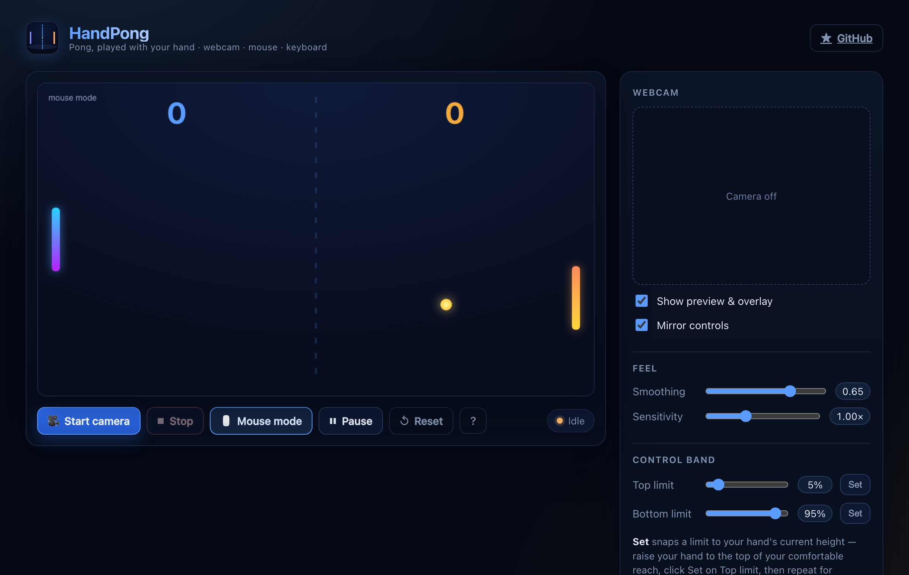

# HandPong

**Play classic Pong with your hand.** HandPong uses your webcam and Google's
[MediaPipe Hands](https://developers.google.com/mediapipe/solutions/vision/hand_landmarker)
to track your index fingertip in real time and map it to the paddle — no
controller, no keyboard required. Mouse and keyboard fallbacks are built in for
when the camera isn't available.

[](https://github.com/VitalyVorobyev/handpong/actions/workflows/ci.yml)
[](https://vitalyvorobyev.github.io/handpong/)
[](LICENSE)

### ▶ [Play the live demo](https://vitalyvorobyev.github.io/handpong/)



## Features

- **Real-time hand tracking** — your index fingertip drives the left paddle via MediaPipe Hands.
- **Single-player vs. AI** — beat the built-in opponent; scores are tracked on screen.
- **Calibrate to your reach** — set a control band (top/bottom limits) so a comfortable hand range covers the whole court.
- **Tunable feel** — adjust motion smoothing and sensitivity live.
- **Webcam preview & overlay** — optional mirrored preview shows the detected hand and your control band.
- **Graceful fallbacks** — mouse or `↑ / ↓` arrow keys take over if the camera is blocked.
- **Pause, resume, reset** at any time.

## Quick start

Requires [Bun](https://bun.sh) `>= 1.3`.

```bash
bun install
bun run dev
```

Open the printed local URL (e.g. `http://localhost:5173`) and allow camera
access. The webcam needs a secure context — `http://localhost` and `https://`
both qualify.

## How to play

1. Click **Start camera** and allow access when prompted.
2. Move your hand up and down — your index fingertip controls the left paddle.
3. Keep the ball from passing your paddle while trying to get it past the AI.

No camera? Toggle **Mouse mode** and steer with the mouse, or use the `↑ / ↓`
arrow keys.

**Tip:** use the **Control band** sliders (or the **Set** buttons, which snap a
limit to your hand's current height) so your natural up/down range maps to the
full height of the court.

## How it works

```
webcam frame ─▶ MediaPipe Hands ─▶ index fingertip (landmark 8, normalized y)
                                          │
                       control-band remap (top/bottom) → game height
                                          │
                       sensitivity → smoothed paddle target
                                          │
              requestAnimationFrame physics loop ─▶ canvas render
```

The game state lives in a single mutable ref and is updated every animation
frame, deliberately decoupled from React renders. MediaPipe is loaded from a CDN
at runtime — there is no `@mediapipe/*` build dependency. See
[`CLAUDE.md`](CLAUDE.md) for a fuller architecture tour.

## Tech stack

- [React 19](https://react.dev/) + [TypeScript](https://www.typescriptlang.org/)
- [Vite](https://vite.dev/) for dev server and builds
- [MediaPipe Hands](https://developers.google.com/mediapipe/solutions/vision/hand_landmarker) for gesture detection
- [Bun](https://bun.sh) as package manager and task runner
- ESLint for linting

## Development

```bash
bun run dev        # start the Vite dev server
bun run lint       # ESLint
bun run typecheck  # tsc project build (type-check only)
bun run build      # type-check + production build to dist/
bun run preview    # serve the production build locally
```

## Deployment

Pushes to `main` are built and deployed to **GitHub Pages** by the
[CI workflow](.github/workflows/ci.yml) — the live demo is the deployed game
itself. Production builds use a `/handpong/` base path (configured in
[`vite.config.ts`](vite.config.ts)) to match the project Pages URL.

To enable it on a fork: in **Settings → Pages**, set **Source** to
**GitHub Actions**.

## Requirements

- A webcam (for hand control) — optional; mouse/keyboard work without one
- A modern browser with JavaScript enabled (Chrome recommended)
- Adequate lighting for reliable hand detection

## Troubleshooting

- **Hand not detected** — improve lighting and use a plainer background; keep your hand within the preview frame.
- **Camera won't start** — check browser permissions and that no other app holds the camera; you can always switch to Mouse mode.
- **Choppy tracking** — close other heavy tabs/apps; the model runs entirely on your machine.

## License

MIT — see [LICENSE](LICENSE).

## Acknowledgments

- Inspired by the classic Pong arcade game
- Hand tracking by [MediaPipe](https://developers.google.com/mediapipe)
